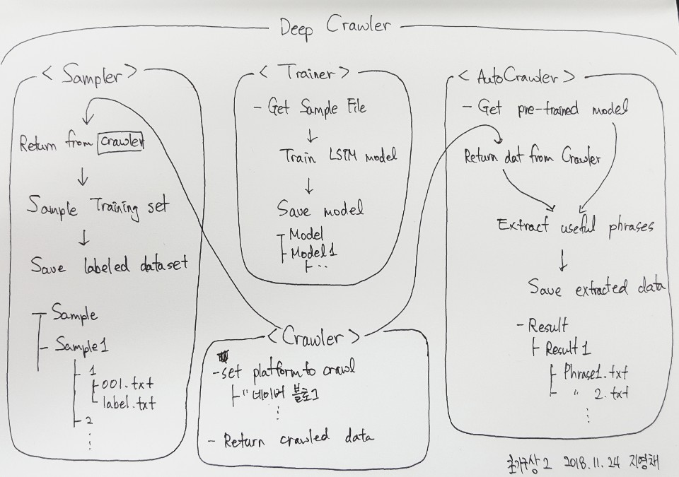

# DeepCrawler
Deep learning based Smart Web Crawler

## Motivation
We do web crawling all the time to get the data that we need. However there is time consuming and frustrating process of classifing useful and unuseful data. Our team wanted to reduce the time of doing so by implementing deep learning techniques to find user-customized useful patterns inside web crawled data.
## Plan
We are at the stage of planning out smart ways to solve this problem. Please contact us if you have any idea.

### Primary Structure

#### -Using Only LSTM
1. Crawl as usual
2. Go through HTML source code and get the most useful phrase.

#### -Using CNN + LSTM
1. Crawl as usual
2. Using CNN find the most likely region
3. Go through HTML source code in the region detected from #2. Use LSTM to get the most useful phrase.